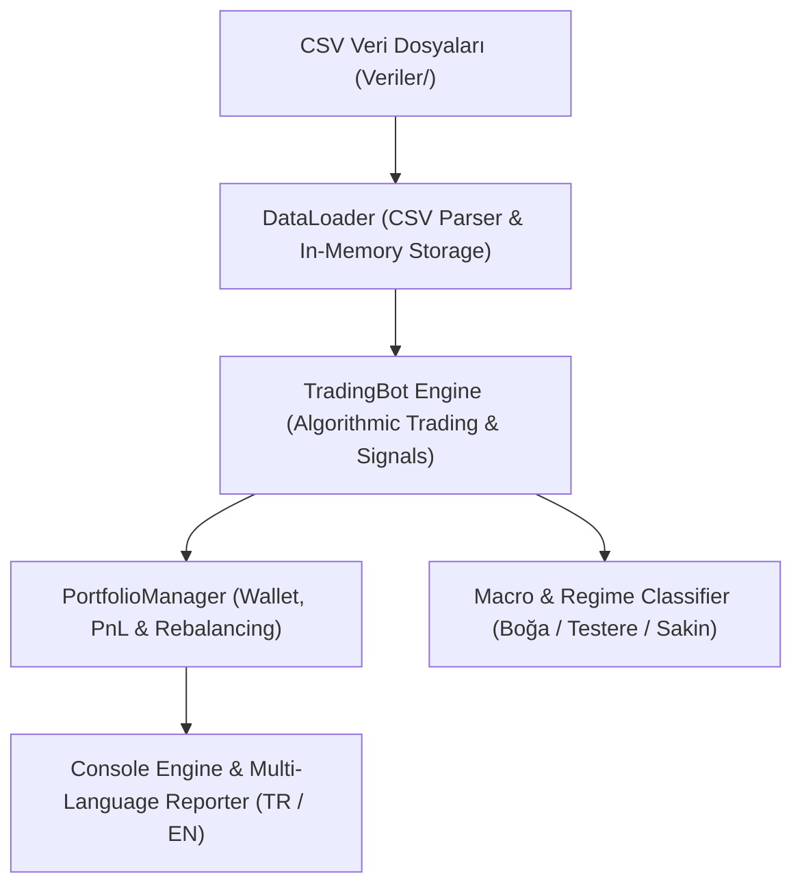

# 🏗️ GravenAbyss - Sistem Mimarısı ve Özellikler Rehberi

Bu doküman, **GravenAbyss Multi-Asset Paper-Trading Algoritmik Yatırım Sistemi**'nin teknik mimarisini, veri işleme hattını, ticaret algoritmalarını ve risk yönetimi kalkanlarını detaylandırır.

---

## 🏛️ 1. Genel Yazılım Mimarisi

Sistem, nesne yönelimli mimari (OOP) ilkelerine uygun olarak modüler bir yapıda C# (.NET Framework 4.7.2) ile geliştirilmiştir.

---

## 🛠️ 2. Temel Modüller ve Bileşenler

### 1. `DataLoader` (Çevrimdışı Veri Motoru)
- `Veriler/` klasöründeki `.csv` uzantılı hisse verilerini tarar.
- Hem Türkçe (`24.07.2026`, `,` virgül ayrıştırıcı) hem de İngilizce (`2026-07-24`, `.` nokta ayrıştırıcı) tarih ve fiyat formatlarını sıfır hatayla işler.
- Verileri bellek içinde `StockData` nesnelerine dönüştürür.

### 2. `TradingBot` (Algoritmik Ticaret Motoru)
- **Sinyal Üretimi:** 20 günlük Donchian Kırılımı + EMA Boğa Zırhı (`Price >= EMA20 && Price >= EMA50 && Price >= EMA200`) + RSI ve Hacim Onayı.
- **Emir Gerçekleme:** T+1 Açılış Fiyatından Gerçekleme (Look-Ahead Bias %0).
- **Stok Split Algılayıcı:** Fiyattaki %25+ ani bölünme boşluklarını algılar, maliyeti revize eder ve lot katlamasını yapar (`1:1.42`, `1:1.62`, `1:1.35`, `1:1.44`, `1:2.93`).

### 3. `PortfolioManager` (Portföy ve Risk Yöneticisi)
- Nakit bakiye, hisse lotları, ortalama maliyetler ve PnL takibini yapar.
- Kârlı hisseleri yıl sonunda satmayıp yeni yıla kesintisiz taşıyarak bileşik büyüme sağlar.
- Nakit çekim modunda kârlı hisseden parça satışı yaparak Akıllı Rebalans uygular.

---

## 🛡️ 3. Algoritmik Risk ve Sermaye Koruma Kalkanları

1. **🛡️ Makro Rejim Kalkanı:** Piyasa yapısı `"Boğa Piyasası"` durumunda değilse yeni pozisyon açmaz; yatay ve testereli piyasalardaki sahte kırılımları eler.
2. **🎯 Zirve Tabanlı İzleyen Stop (Trailing Stop):** Hissenin ulaştığı en yüksek tepe fiyatı anlık takip eder. Fiyat tepe noktadan esnediğinde kârı kilitler.
3. **🛡️ ATR Risk Kalkanı:** Piyasa çöküşlerinde volatiliteye dayalı ATR stop-loss oranını hesaplayarak zararı kısıtlar.
4. **🛑 2-Stop 45-Gün Karantina Zırhı:** 60 gün içinde 2 kez stop yazdıran hisselere 45 gün zorunlu karantina uygular. Düzeltmedeki kaliteli hisselerde üst üste stop yenmesini engeller.
5. **⚡ T+1 Gap-Up Tavan Kalkanı:** BİST piyasasında +%9.5 üzeri kilit tavan açılışlarında alım emrini iptal eder.

---

## 📊 4. Doğrulanmış Simülasyon Metrikleri

* **Amerikan Piyasası (US-50 🇺🇸) + Agresif Mod (%90 Bütçe):**
  - **Net Getiri:** **+%110,79 Net Kâr (50.000 TL ➔ 105.395,16 TL)**
  - **Profit Factor:** **4.14** *(Wall Street Elit Standartı > 3.0)*
  - **Win Rate:** **%50,0**

* **Borsa İstanbul (BİST 🇹🇷) + Dengeli Mod (%70 Bütçe):**
  - **Net Getiri:** **+%73,67 Net Kâr (50.000 TL ➔ 86.834,67 TL)**
  - **Profit Factor:** **3.59**
  - **Win Rate:** **%57,1**
